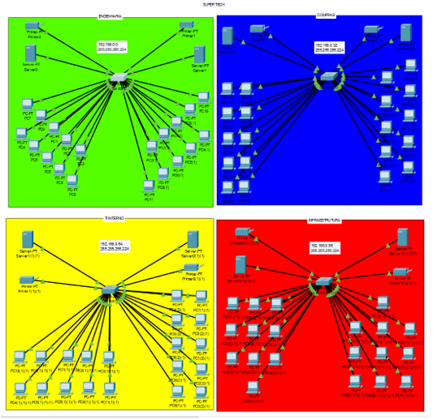

# ROTEIRO DE AULA PRÁTICA Redes e Sistemas Distribuídos
 Simular uma rede de computadores utilizando equipamentos, protocolos e configurações presentes em situações reais. Criação de estrutura de rede de computadores da Empresa Super Tech, utilizando o programa Cisco Packet Tracer. Criar um relatório no final da atividade

